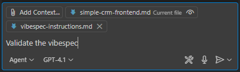

# Vibespec

> **Software spec definition in the vibe coding era**  

Vibespec is a specification for describing a software application or system, optimized for an LLM for 
generating code in a consistent and repeatable way. Instead of ad hoc prompting through trial and error, 
you describe the software you want in **one single file**. Vibespecs are incredibly flexible and can be as 
simple or as complex as needed to fully describe the software system. 

**Vibespec is a minimalist approach to spec-driven development.**

## Problem Statement

Building a production-ready application through prompt iteration is cumbersome, chaotic, and 
non-deterministic, akin to developing an enterprise cloud solution using point and click deployment. 
As code generation tools and their underlying LLMs evolve, the need for a structured approach to 
describe software systems that can be generated in a repeatable and deterministic way becomes paramount.

Product requirements documents (PRDs) and software requirements documents (SRDs) are often too 
high-level and lack the detail needed for effective code generation. Vibespecs combine the best 
aspects of these documents with a structured format that is optimized for LLMs, enabling developers to 
describe software systems in a way that can be translated directly into code.

## Design Goals

- **LLM Optimized**: The specification should be designed to maximize the effectiveness of LLMs in generating code. 
- **Infinitely Flexible**: The specification can be as simple or as complex as needed to fully describe the software system.
- **Simple**: The specification should be easy to understand and use, even for those with limited technical expertise.
- **Repeatable**: The specification should allow for the generation of the same code from the same description, ensuring consistency and reliability.
- **Structured**: The specification should provide a clear structure for describing the software system, making it easier to understand and maintain.
- **Multimodal**: The specification should support various types of content, including text, images, code snippets, flow diagrams.
- **Autonomous Agent Friendly**: Autonomous agents should be able to read the changed vibespec and apply the changes to the codebase without manual intervention.

## Getting Started

### Load Instruction File

To get started with Vibespec, you need to load the instruction file named `vibespec-instructions.md` into 
your coding agent e.g. GitHub Copilot, Claude Code, etc. This file contains the definition of a vibespec 
and provides guidance on how to use it effectively. 

Validate that the instruction file is loaded correctly in your chat prompt:
```
Are the vibespec instructions loaded correctly?
```

You should get a response like:
```
Yes, the vibespec instructions are loaded correctly. The file vibespec-instructions.md is present in 
your workspace and contains detailed guidance on the structure, commands, validation, and 
change management for vibespec files. 
```

### A Basic Vibespec

Although you can (and should) add structured details to your Vibespec, a basic one can be as simple as 
describing your application in a few sentences. For example:

```markdown
# Tetris Clone

This is a vibespec for a Tetris clone that allows users to play the classic game in their web browser. 
The game should have a simple UI, support keyboard controls, and keep track of the score. It should be 
built using vanilla JavaScript and TypeScript.
```

### A More Detailed Vibespec

A more detailed vibespec can include sections for user stories, specifications, and domain-specific terms. For example:

```markdown
# Tetris Clone

This is a vibespec for a Tetris clone that allows users to play the classic game in their web browser. The game should have a simple UI, support keyboard controls, and keep track of the score. It should be built using vanilla JavaScript and TypeScript.

## Specs
- type: web
- frameworks: none
- languages: JavaScript, TypeScript

## Requirements
- The game should have a simple UI with a grid for the Tetris blocks.
- The game should support keyboard controls for moving and rotating the blocks.
- The game should keep track of the score and display it on the screen.
- The game should be responsive and work on different screen sizes.
```

### Using your LLM to Create a Vibespec

Once you have the instruction file loaded, you can use your LLM to create a vibespec for your software system.

Follow these steps:
1. Create a new file named `my-software-system-vibespec.md` (named according to your app).
2. Fill out your Title and basic description.
3. Prompt your LLM to generate a vibespec based on the description. For example:
  `Generate a vibespec based on the description. I want to use Java Spring Boot with Gradle for this backend API.`

This will help you get started. Browse the **Structure** section below for more details on how to structure your vibespec.

## Structure

A vibespec is typically a markdown document, and is structured with a specific format that includes a title, description, specification, and sections. The structure is designed to be flexible and can be adapted to fit the needs of the software system being described.

The vibespec structure was purposefully designed to flow from high-level concepts to detailed implementation. This is by design--to aid the LLM (and you) in understanding the software system from a general to specific matter to optimize the code generation.

> Browse the full [vibespec structure](structure.md).

### Sections
None of the sections are explicitly required, but they provide a structured way to describe the software system. Mixing and matching sections is encouraged to best fit the needs of the software being generated.

#### Features
Describes the high-level features of the software system, provided more for human-readability but can assist the LLM in steering code generation.

#### Requirements
Describes the requirements of the software system, typically [functional](https://en.wikipedia.org/wiki/Functional_requirement), [non-functional](https://en.wikipedia.org/wiki/Non-functional_requirement), and technical requirements. 
You can also break this out into subsections like "Functional Requirements" and "Non-Functional Requirements".

#### Considerations
Describes any considerations, constraints, or assumptions that should be taken into account when developing the software system.

#### User Stories
Outlines the user stories that describe how users will interact with the software system. User stories are typically written in a specific format, such as "As a [user], I want to [do something] so that [I can achieve a goal]."

#### Data Model (or Data Design)
Describes the data model of the software system, including the structure of the data, relationships between data entities, and any relevant data types. This section can include diagrams or code snippets to illustrate the data model.

#### Architecture (or Design)
Describes the high-level structure of the software system, including its components, modules, and their interactions. Should include diagrams, such as component diagrams, sequence diagrams, or deployment diagrams, to illustrate the architecture. Describes software patterns like facade, inversion of control/dependency injection, etc.

#### UI
Describes the user interface design and user experience considerations for the software system, including layout, navigation, and accessibility. Can provide links to design mockups or wireframes.

#### API
Describes the API endpoints, request/response formats, and any relevant API documentation for the software system. This section can include details about authentication, authorization, and error handling.

#### Database
Describes the database design and data storage considerations for the software system, including data models, relationships, and any relevant database technologies.

#### Setup
Describes the project scaffolding and setup and instructions, including build tools and any necessary dependencies. If omitted, the LLM will prompt you to ask if you want to scaffold the project in a minimalist way.

#### Implementation
This section describes the concrete implementation details, the "how" of the software system. This is strictly optional, and intended for seasoned developers who want to steer the exact implementation details that the LLM will use to generate code. 

#### Testing
Describes the testing strategy and approach for the software system, including unit tests, integration tests, and end-to-end tests. Can also include details about testing frameworks and tools.

#### Deployment
Describes the deployment strategy and process for the software system, including hosting, containerization, DevOps processes, and any relevant deployment tools or platforms.

#### Issues
Describes any known issues, bugs, or limitations of the software system. This section can also include a list of open issues or a link to an issue tracker.

#### Glossary
Defines any jargon or domain-specific terms that are relevant to the software system. This section can help clarify terminology for both developers and non-technical stakeholders.

#### References
Includes any references to external documents, APIs, or resources that are relevant to the software system.

## Commands

> **Note**: When running commands in an IDE such as GitHub Copilot Chat, the vibespec file should be the opened file. Ensure the instruction file is loaded into context. 

> 

### Validating the Vibespec

With the instruction file loaded, you can now `validate` your vibespec by prompting your coding agent:
```
Validate the vibespec.
```

### Code Generation

Prompt your coding agent to `generate` code based on the vibespec. Note that this will also trigger validation, but the coding agent will warn you of any issues before proceeding:
```
Generate code.
```

### Updating Code

Prompt your coding agent to update code based on the vibespec. Since the vibespec works in a desired-state model, it is similar to code generation, however, the `update` command is optimized for incremental synchronization after changes.
```
Update code.
```

### Simulating Code Generation or Updates

You can also simulate code generation by prompting your coding agent to `describe` the changes it will make based on the vibespec.
```
Describe the changes you will make to the codebase based on the vibespec.
```

### Project Setup

In certain cases, you may want to scaffold the project as a separate `setup` step. You can do this by prompting your coding agent:
```
Setup the project.
```

### Creating a Vibespec

You can `create` a vibespec file from an existing project:
```
Create a vibespec for the existing project.
```

## Change Management

### Execution Plan

When applying changes from a vibespec, the LLM will generate a execution plan in the `.vibespec` folder of the project. This will allow the agent to track changes being made to the codebase based as it goes. This file will include a summary of the changes, the date and time of the change, and any relevant details about the modifications.

### Editing Code
The vibespec is a living, breathing doc, but that shouldn't stop you from modifying the generated code. Although the term *vibe coding* means not touching a line, in the real world to build a production-ready application, you will at some point need to modify your own code. The vibespec is designed to be flexible and can be updated as needed to reflect changes in the software system. 

## Artifacts

### Images
You can include images in your vibespec to provide visual context or diagrams related to the software system. Images can be included using standard markdown syntax.

### Embedded Content
Include diagrams, flowcharts, or other visual representations of the software system using embedded content. This can help clarify complex structures or workflows.

### MCP Servers
Explicitly reference MCP servers that you have already configured in your IDE or agent along with key command words for that MCP server. For example, you can reference a [Figma MCP server](https://help.figma.com/hc/en-us/articles/32132100833559-Guide-to-the-Dev-Mode-MCP-Server) for design mockups or a GitHub MCP server for code repositories.

```markdown
## UI
### Design Mockups
Page wireframes are in these Figma node IDs:
- `123:456`
- `123:457`
- `123:458`
```

### Code Snippets
You can include code snippets in your vibespec to provide examples of specific functionalities or implementations. You can also point to external code repositories or files for more extensive code examples.

### Special Tokens
Each coding agent has built-in special tokens that can be used to control the behavior of the agent. For example, in GitHub Copilot, you can access special agents like `@workspace` or variables like `#codebase` to refer to the current codebase. Use this as you normally would in the chat window.

## Examples

I'll be adding more examples over the coming weeks, but here are some to get you started:

- [Simple CRM web app](examples/simple-crm-vibespec.md)
- [Tetris clone (basic)](examples/tetris-clone-vibespec-basic.md)
- [Tetris clone (detailed)](examples/tetris-clone-vibespec-detailed.md)
- [Earth Orbit Visualizer](examples/earth-orbit-visualizer-vibespec.md)
<!--
coming soon:
- [Fashion Store with Figma MCP](examples/fashion-store-vibespec.md)
- [Reddit clone](examples/reddit-clone-vibespec.md)
- [Python stock data library](examples/python-stock-data-vibespec.md)
- [Azure Function](examples/azure-function-vibespec.md)
- [CMS-as-a-service](examples/content-as-a-service-vibespec.md)
-->

## Best Practices

- Start with a basic vibespec that describes your software system in a few sentences, add sections with more detail, and iterate.
- Ask the LLM to validate your vibespec and describe the changes it will make before implementing them. This will help you troubleshoot your vibespec (i.e. if context window is exceeded) before executing on it.
- The sections are defined to have some overlap by design, however it is best to avoid repeating information. Use intra-document links to reference other sections or subsections when needed.
- Split complex systems into multiple vibespecs using references, each focusing on a specific aspect of the system. This allows for better organization and easier management of the specifications.
- Commit code changes by the LLM often. Better yet, commit vibespec changes and code changes together. In a future update the instructions may include a note to analyze the commit history.
- Although you can put special code instructions in the vibespec, it is best to keep the vibespec focused on the software system and its specifications. Use your coding agent's instruction files/system prompts to outline coding conventions. For example, for GitHub Copilot, use the `.github/copilot-instructions.md` file.

### GitHub Copilot

- Use GitHub Copilot's chat interface to interact with the LLM and provide it with the vibespec instruction file.
- If you are working in a monorepo, open the folder containing the vibespec file in your IDE. This ensures that the agent will always execute terminal commands in the correct folder.

## Limitations

- In many cases, coding agents like GitHub Copilot or Claude Code are working on older data and if you are not explicit in certain implementation details, will attempt to generate code based on this older data.
- All coding agents are known to generate hallucinated, error-prone code. You can mitigate this using the **Issues** section to describe known bugs and direct your coding agent to fix.
- While implementing the vibespec, GitHub Copilot will stop repeatedly asking you to confirm the changes it will make. You need to nudge it via prompt to resume the implementation. 
- Vibespecs are not designed to describe complex enterprise-wide systems or architectures. They are best suited for describing specific software applications or systems, such as web applications, APIs, or libraries.

## Extending

Extending the vibespec specification is possible by adding new sections, subsections, or properties to existing sections. This allows you to customize the vibespec to fit the specific needs of your team or project.

Update the `vibespec-instructions.md` file.


## Exercise

### 1 - Ask ChatGPT or Claude to generate a SRD for a Reddit clone.

```
Generate a sample, simplified SRD for Reddit. 
Assume I am building a Reddit clone for the first time so this is version 1.0. 
Also assume there is only a web version for now.
```

### 2 - Convert the SRD into a Vibespec

First, think about what frontend framework you want to use i.e. React, Vue, Svelte, etc. Then, convert the SRD into a vibespec by following the structure outlined above.

```
Convert the SRD into a vibespec for a Reddit clone. A vibespec is a specification for describing a software application or system.
I have attached the vibespec definition.
```

### 3 - Ask the LLM to generate code from the Vibespec

Use Claude Code or GitHub Copilot to generate code from the vibespec. 

## FAQ

### Why can't I just write an SRD and have the LLM generate code from it?
An SRD (Software Requirements Document) is typically a high-level document that outlines the requirements and functionalities of a software system. While it provides a good foundation, it often lacks the detailed structure and specific instructions needed for an LLM to generate code effectively. Vibespec aims to bridge this gap by providing a more structured and detailed specification that can be directly translated into code.

### Isn't using a vibespec to build a software system like going back to waterfall-based development?
Not necessarily. While Vibespec does provide a structured approach, it is designed to be flexible and iterative. It allows for continuous refinement and adaptation of the software system as requirements evolve, similar to agile methodologies. The key difference is that Vibespec is optimized for LLMs, enabling more efficient code generation and reducing the need for extensive manual coding.

### Amazon Kiro just released and it encompasses spec-driven development. How is Vibespec different?
[Amazon Kiro](https://kiro.dev/) is an IDE and a fork of Visual Studio Code (just like Cursor and Windsurf). Vibespec is a specification + instructions for the LLM (although I may develop some basic tooling in the near future) that is open-source and can be used with any LLM, IDE, or coding agent. 

One key difference that Kiro offers is the ability to sync code back to specs. Vibespec will never do that. I believe in the unidirectional flow of specs to code, not the other way around. Otherwise, bugs unintentionally become features, and no one wants that.
